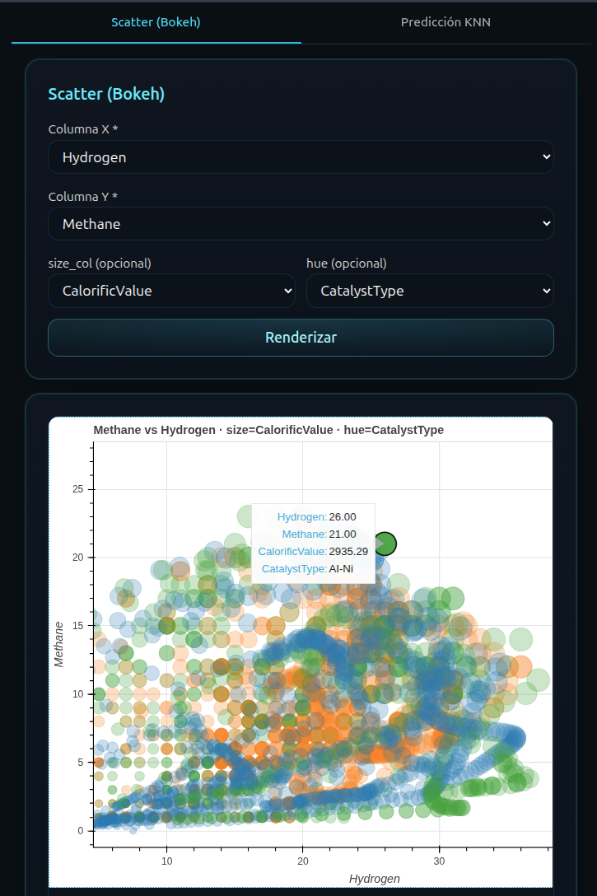
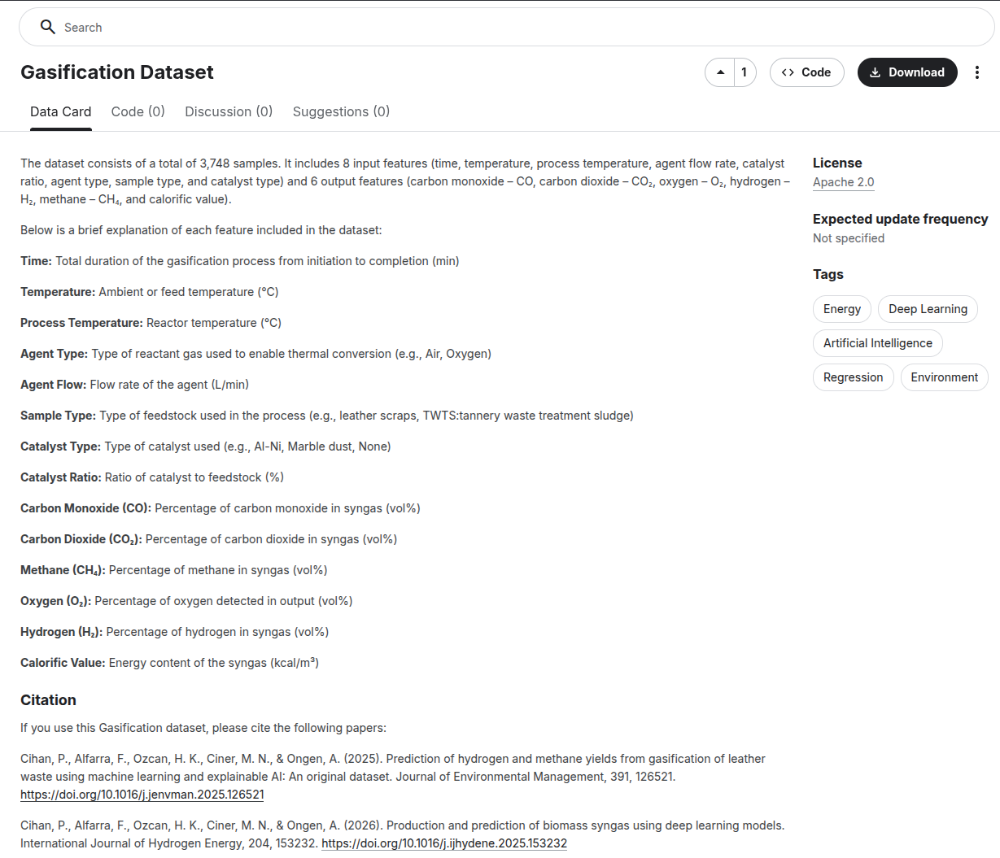

# Full-Stack Data Science & ML Dashboard

Este proyecto es una **aplicación web full-stack** desarrollada como parte de un seminario de investigación universitaria, cuyo objetivo es **democratizar el acceso a análisis de datos y modelos de Machine Learning** a través de una interfaz moderna, elegante y funcional.

La plataforma permite a los usuarios generar gráficos interactivos y realizar análisis de ciencia de datos sin necesidad de ejecutar scripts en terminal, integrando un modelo de ML que predice variables clave del proceso de gasificación de biomasa.

## Tecnologías

- **Frontend:** SolidJS + Tailwind CSS  
- **Backend:** FastAPI  
- **Contenedores y despliegue:** Docker  
- **Comunicación:** API REST para interacción entre frontend y backend  

## Funcionalidades

1. **Visualización interactiva de datos**  
   - Construcción de gráficos online para explorar datasets de manera dinámica.
2. **Aplicación de Machine Learning**  
   - Uso de modelos previamente entrenados para realizar predicciones sobre nuevas entradas.
3. **Integración full-stack**  
   - Acceso a análisis y resultados a través de un **dashboard web**, sin necesidad de herramientas de línea de comando.
4. **Pipeline reproducible**  
   - Toda la aplicación se puede levantar con Docker, asegurando consistencia y facilidad de despliegue.

### Análisis de Data Science
<div align="center">
  
</div>

### Predicciones de Machine Learning
<div align="center">
  
</div>

## Impacto y motivación

El proyecto se enmarca en la promoción de **energías alternativas y procesos amigables con el medio ambiente**, demostrando cómo la combinación de ciencia de datos, Machine Learning y herramientas web modernas puede **optimizar la investigación y la toma de decisiones en procesos sostenibles**.

## Datos y análisis previos

- **Análisis de Data Science y Machine Learning:**  
  [Repositorio de análisis previo](https://github.com/NiengLee/DS_ML_IQ/tree/main/gasificacion_cuero)  
- **Origen de los datos:**  
  [Dataset de gasificación en Kaggle](https://www.kaggle.com/datasets/miracnurciner/gasification-dataset/data)
   
<div align="center">
  
</div>

## Estructura del repositorio
- `/frontend` → Código de SolidJS y Tailwind CSS  
- `/backend` → API FastAPI y lógica de ML  

## Instalación y ejecución
1. Clonar el repositorio:  
   ```bash
   git clone <repo-url>
   ```

2. Poner en marcha con docker:
   Ejecutar este comando ubicado dentro del proyecto:

    ```bash
    docker-compose up --build
    ```